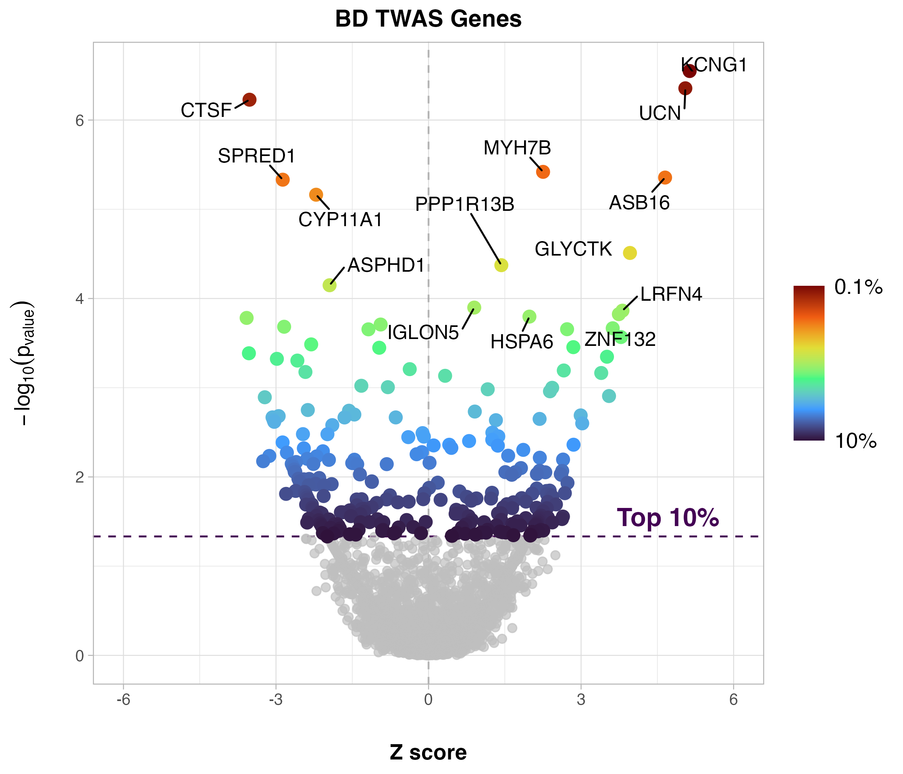
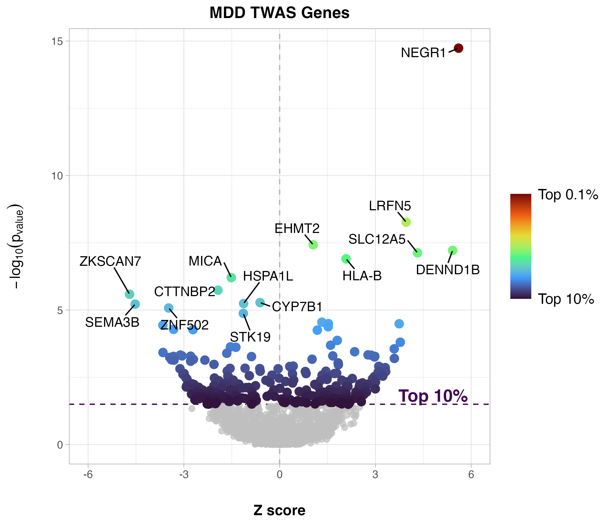
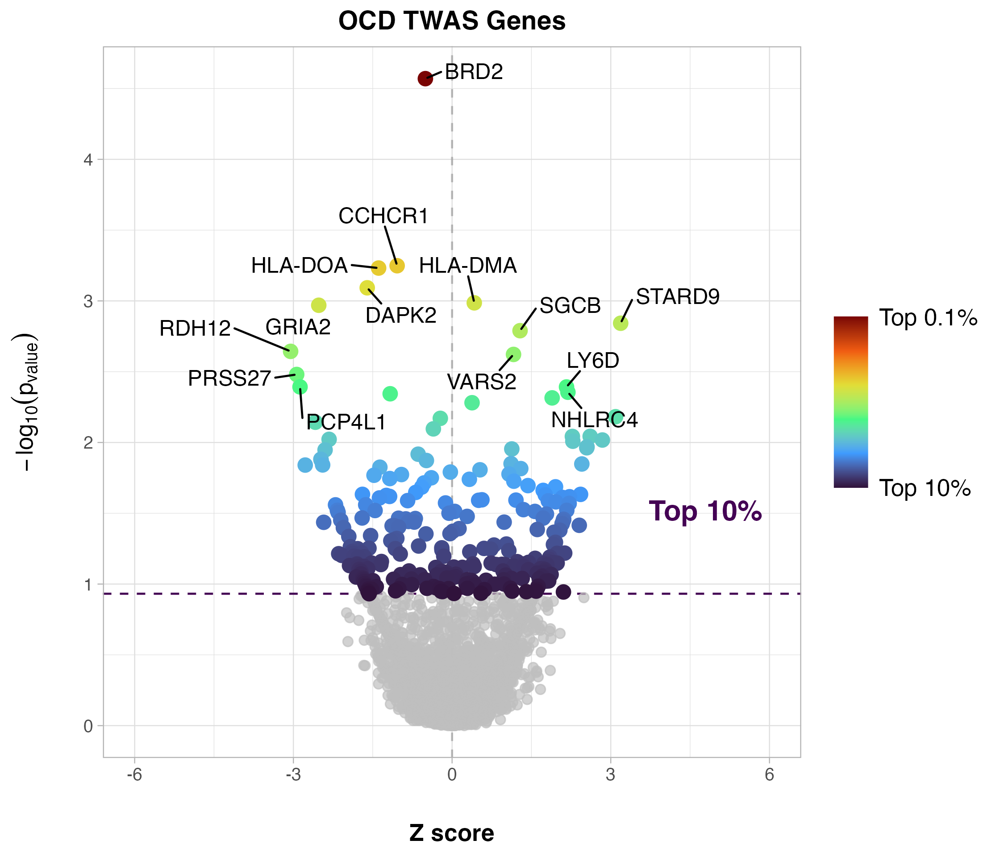
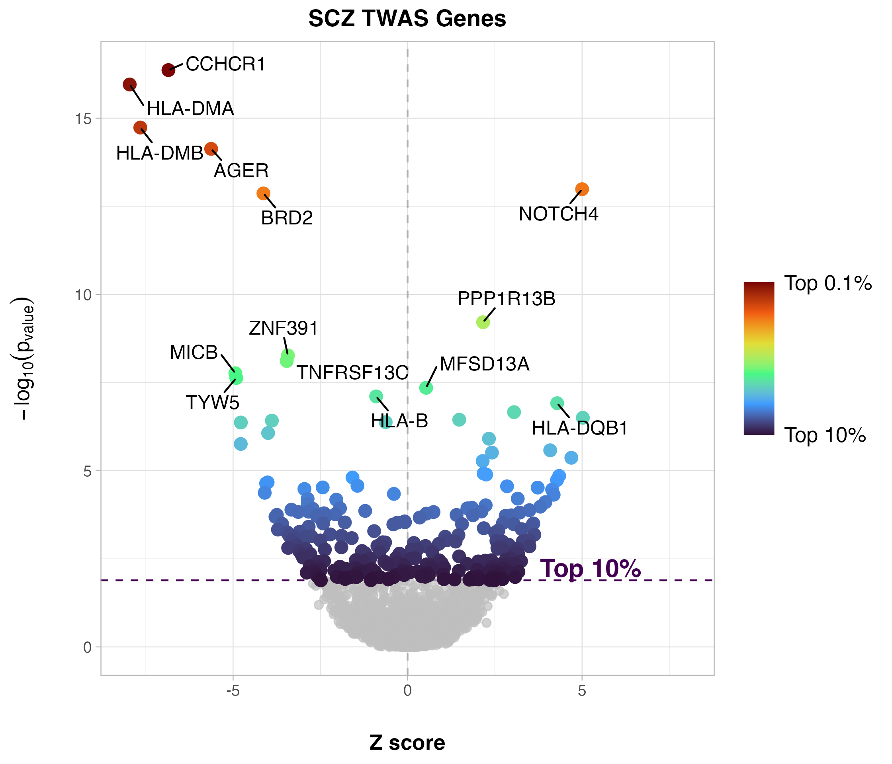

# Intersection of Genetics and Brain Imaging Features for Neuropsychiatric Disorders

## Introduction

## Research question

## Graphical Abstract

## Data

The main sorces of data for the project are:

- Neuroimaging data: neuroimaging data come from the ENIGMA summary statistics (available [here](https://enigma.ini.usc.edu/research/download-enigma-gwas-results/)). In particular for the analysis here presented we use the cortical and subcortical cortical thickess averaged between left and right hemisphere.
- GWAS data: GWAS data used are from the [PGC](https://pgc.unc.edu/).
- eQTL data for TWAS: eQTL data for TWAS are available from [PredictDB](https://predictdb.org/). For the prediction of eQTL we are using elastic-net models.

## Methods

GWAS data for all of the disorders were analysed with the same exact pipeline, using PrediXcan adn MultiXcan, using as prediction models all of the elastic net models from the brain, excluding the brainstem (all sampling regions are shown in figure below).

*Sampling sites in of GTEx*

Genes resulting from the TWAS analysis from PrediXcan and MultiXcan were used to calculate transcriptomic polygenic risk scores (TPRS) using a strategy similar to that done [here](https://genomebiology.biomedcentral.com/articles/10.1186/s13059-021-02591-w). This score is calculated as:

$`TPRS = \sum^{N} w_{i}*G_{i}`$

where $G_{i}$ represents the AHBA expression data for gene $i$, $w_{i}$ is the weight used to weight the gene corresponding to the signed $Z_{score}$ obtained from TWAS and $N$ is the number of genes used for the estimation of the score.

To select the number of genes $N$, we adopted a top-gene approach, in which we select the top genes that exceed a threshold of the $p_{value}$-ordered genes. As is done in traditional Poligenic Risk Scores (PRS), we selected an aray of tresholds, to assess the best threshold. In particular, we selected the top $10$, $5$, $1$, $0.5$ and $0.1\%$ of the genes.

TPRS scores were calculated for all regions of the Desikan-Killiany atlas, and correlated used spatial permutations models with ENIGMA summary statistics.

All the afterformentioned steps were repeated for all of the disorders investigated, which are Attention Deficit and Hyperactivity Disorder (ADHD), Anorexia (AN), Autism Spectrum Disorder (ASD), Bipolar Disorder (BD), Major Depressive Disorder (MDD), Obsessive Compulsive Disorder (OCD) and Schizophrenia (SCZ).

## Results & Plots

### ADHD

<figure>
    
    <figcaption> Volcano plot showing the genes derived from TWAS from the GWAS summary statistics and GTEx derived tissue prediction models. Colored points show the genes in the top 10% of genes subsequently used for TPRS calculations. Labelled data points show the top 0.5% of the genes emerging from TWAS analysis.</figcaption>
</figure>

### ASD

<figure>
    
    <figcaption> Volcano plot showing the genes derived from TWAS from the GWAS summary statistics and GTEx derived tissue prediction models. Colored points show the genes in the top 10% of genes subsequently used for TPRS calculations. Labelled data points show the top 0.5% of the genes emerging from TWAS analysis.</figcaption>
</figure>

### AN

<figure>
    
    <figcaption> Volcano plot showing the genes derived from TWAS from the GWAS summary statistics and GTEx derived tissue prediction models. Colored points show the genes in the top 10% of genes subsequently used for TPRS calculations. Labelled data points show the top 0.5% of the genes emerging from TWAS analysis.</figcaption>
</figure>

### BD

<figure>
    
    <figcaption> Volcano plot showing the genes derived from TWAS from the GWAS summary statistics and GTEx derived tissue prediction models. Colored points show the genes in the top 10% of genes subsequently used for TPRS calculations. Labelled data points show the top 0.5% of the genes emerging from TWAS analysis.</figcaption>
</figure>

### MDD

<figure>
    
    <figcaption> Volcano plot showing the genes derived from TWAS from the GWAS summary statistics and GTEx derived tissue prediction models. Colored points show the genes in the top 10% of genes subsequently used for TPRS calculations. Labelled data points show the top 0.5% of the genes emerging from TWAS analysis.</figcaption>
</figure>

### OCD

<figure>
    
    <figcaption> Volcano plot showing the genes derived from TWAS from the GWAS summary statistics and GTEx derived tissue prediction models. Colored points show the genes in the top 10% of genes subsequently used for TPRS calculations. Labelled data points show the top 0.5% of the genes emerging from TWAS analysis.</figcaption>
</figure>

### SCZ

<figure>
    
    <figcaption> Volcano plot showing the genes derived from TWAS from the GWAS summary statistics and GTEx derived tissue prediction models. Colored points show the genes in the top 10% of genes subsequently used for TPRS calculations. Labelled data points show the top 0.5% of the genes emerging from TWAS analysis.</figcaption>
</figure>

#### References
